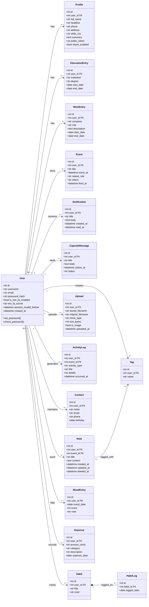

# Class Diagram — Saathi ("Here I Am")

```mermaid
classDiagram
    direction LR
    class User {
      +int id
      +str username
      +str email
      +str password_hash
      +bool is_two_fa_enabled
      +str two_fa_secret
      +datetime session_invalid_before
      +datetime created_at
      +set_password()
      +check_password()
    }
    class Profile {
      +int id
      +int user_id FK
      +str full_name
      +str headline
      +str phone
      +str address
      +str skills_csv
      +text summary
      +str public_token
      +bool share_enabled
    }
    class EducationEntry {
      +int id
      +int user_id FK
      +str institution
      +str degree
      +date start_date
      +date end_date
    }
    class WorkEntry {
      +int id
      +int user_id FK
      +str company
      +str role
      +text description
      +date start_date
      +date end_date
    }
    class Event {
      +int id
      +int user_id FK
      +str title
      +datetime event_at
      +str repeat_rule
      +str status
      +datetime fired_at
    }
    class Notification {
      +int id
      +int user_id FK
      +str title
      +text body
      +datetime created_at
      +datetime read_at
    }
    class CapsuleMessage {
      +int id
      +int user_id FK
      +str title
      +text body
      +datetime unlock_at
      +str status
    }
    class Note {
      +int id
      +int user_id FK
      +int event_id FK
      +str title
      +text content
      +datetime created_at
      +datetime updated_at
      +datetime deleted_at
    }
    class Tag {
      +int id
      +int user_id FK
      +str name
    }
    class Upload {
      +int id
      +int user_id FK
      +str stored_filename
      +str original_filename
      +str mime_type
      +int size_bytes
      +bool is_image
      +datetime uploaded_at
    }
    class ActivityLog {
      +int id
      +int user_id FK
      +int event_id FK
      +str activity_type
      +str title
      +str details
      +datetime occurred_at
    }
    class Contact {
      +int id
      +int user_id FK
      +str name
      +str email
      +str phone
      +date birthday
    }
    class Habit {
      +int id
      +int user_id FK
      +str title
      +str color
    }
    class HabitLog {
      +int id
      +int habit_id FK
      +date logged_date
    }
    class MoodEntry {
      +int id
      +int user_id FK
      +date mood_date
      +int score
      +str note
    }
    class Expense {
      +int id
      +int user_id FK
      +int amount_cents
      +str category
      +str description
      +date expense_date
    }

    User "1" --> "0..1" Profile : has
    User "1" --> "0..*" EducationEntry : has
    User "1" --> "0..*" WorkEntry : has
    User "1" --> "0..*" Event : owns
    User "1" --> "0..*" Notification : receives
    User "1" --> "0..*" CapsuleMessage : seals
    User "1" --> "0..*" Note : owns
    User "1" --> "0..*" Tag : creates
    User "1" --> "0..*" Upload : uploads
    User "1" --> "0..*" ActivityLog : generates
    User "1" --> "0..*" Contact : maintains
    User "1" --> "0..*" Habit : tracks
    User "1" --> "0..*" MoodEntry : logs
    User "1" --> "0..*" Expense : records
    Habit "1" *-- "0..*" HabitLog : logged_on
    Note "0..*" --> "0..*" Tag : tagged_with
```
