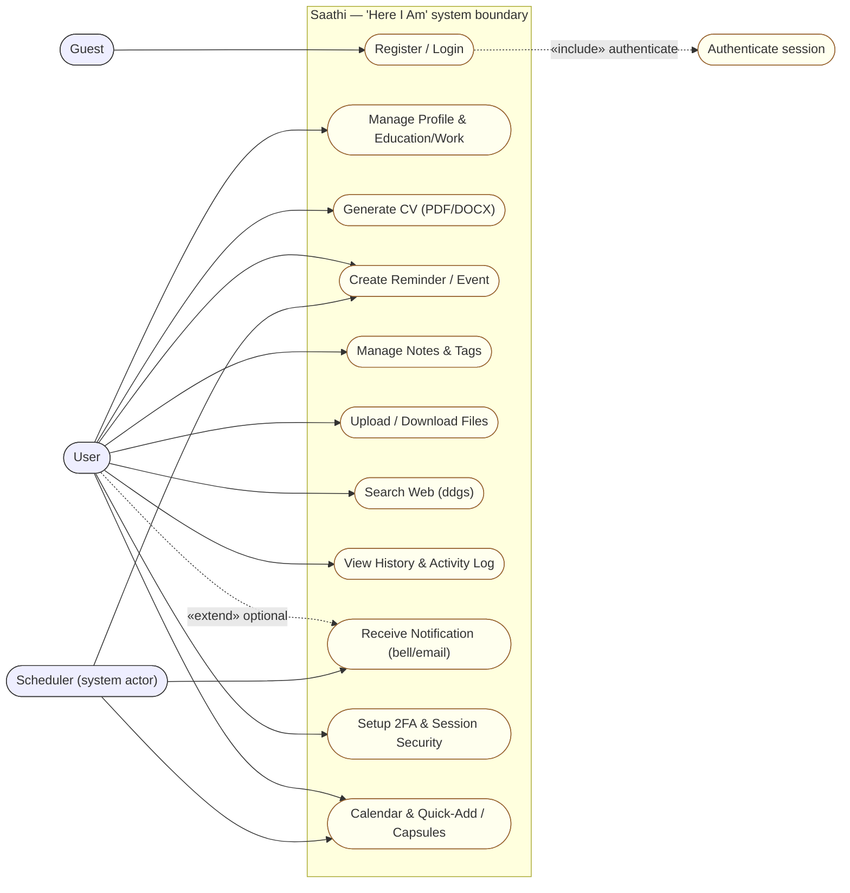

# Use Case Diagram — Saathi ("Here I Am")

```mermaid
flowchart LR
    Guest(["Guest"]):::actor
    User(["User"]):::actor
    Sched(["Scheduler (system actor)"]):::actor

    subgraph SAATHI["Saathi — 'Here I Am' system boundary"]
      UC1(["Register / Login"]):::uc
      UC2(["Manage Profile & Education/Work"]):::uc
      UC3(["Generate CV (PDF/DOCX)"]):::uc
      UC4(["Create Reminder / Event"]):::uc
      UC5(["Manage Notes & Tags"]):::uc
      UC6(["Upload / Download Files"]):::uc
      UC7(["Search Web (ddgs)"]):::uc
      UC8(["View History & Activity Log"]):::uc
      UC9(["Receive Notification (bell/email)"]):::uc
      UC10(["Setup 2FA & Session Security"]):::uc
      UC11(["Calendar & Quick-Add / Capsules"]):::uc
    end

    Guest --> UC1
    User --> UC2 & UC3 & UC4 & UC5 & UC6 & UC7 & UC8 & UC10 & UC11
    User -.->|"«extend» optional"| UC9
    UC1 -.->|"«include» authenticate"| UC1b(["Authenticate session"]):::uc
    Sched --> UC9
    Sched --> UC4
    Sched --> UC11

    classDef actor fill:#eef,stroke:#333;
    classDef uc fill:#ffe,stroke:#963;
```
